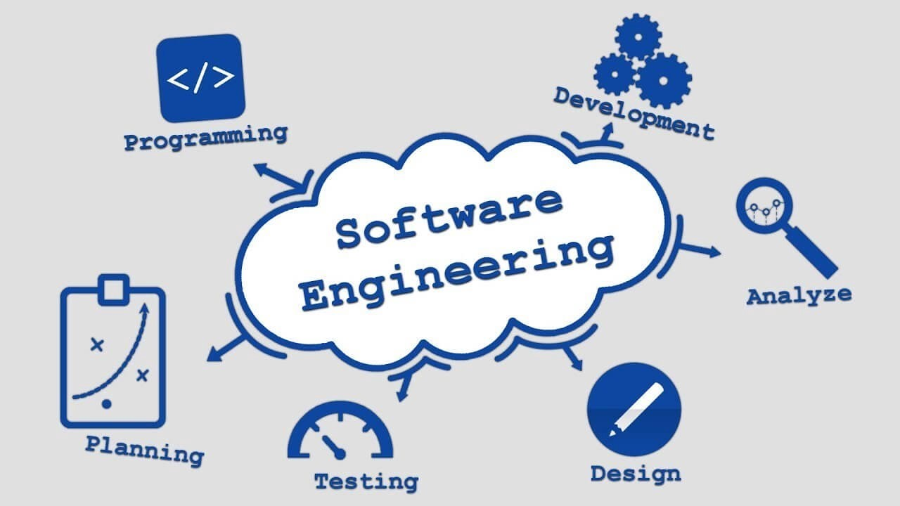

# **Software Engineering**

## _**Table of Content**_

| **Unit** |                                  **Title**                                 |
|:--------:|:--------------------------------------------------------------------------:|
|    1     |[**``Introduction``**](Unit/Unit-1.md)                                      |
|    2     |[**``Software Development Process Model``**](Unit/Unit-1.md)                |
|    3     |[**``Software Requirement Analysis and Specification``**](Unit/Unit-1.md)   |
|    4     |[**``Software Design``**](Unit/Unit-1.md)                                   |
|    5     |[**``Coding``**](Unit/Unit-1.md)                                            |
|    6     |[**``Software Testing and Quality Assurance``**](Unit/Unit-1.md)            |
|    7     |[**``Software Maintanance``**](Unit/Unit-1.md)                              |
|    8     |[**``Managing Software Projects``**](Unit/Unit-1.md)                        |

